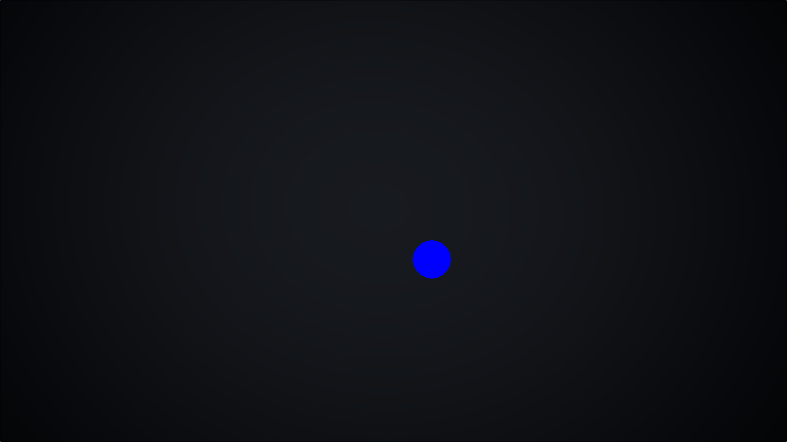

# Crust

[](https://crates.io/crates/crust-engine)
[](https://www.gnu.org/licenses/gpl-3.0.en.html)


Welcome to the documentation for ✨ **Crust** ✨ - a Scratch-like game development tool with its own programming language, also named Crust.

---

## What is Crust?

Crust is a game development tool that allows users to create games using text-based programming instead unlike Scratch. Main features include but are not limited to:

- Text-based programming language
- A lot of functions from Scratch
- Runs at a smooth 60 FPS instead of 30 FPS in Scratch
- Supports all major platforms (Windows, macOS, Linux) except mobile
- Open-source and free to use

## Example

```toml
debug_options = []

[stage]
backdrops = [ "backdrop_0.png" ]

[[sprites]]
name = "example"
code = "example.crst"
sounds = []
costumes = []
x = 0
y = 0
w = 1
h = 1
```

```
// This is a simple Crust program that draws a blue circle on the screen

setup {}

update {
    set_color(0, 0, 255) // Set color to blue
    circle(100, 100, 50) // Draw a circle at (100, 100) with a radius of 50
}
```

The output:



## Contributing

If you want to contribute to Crust or want to report a bug, please visit our [GitHub repository](https://github.com/Muhtasim-Rasheed/crust).

## License

Crust is licensed under the [GNU GPLv3](https://www.gnu.org/licenses/gpl-3.0.en.html). You can use, modify, and distribute it under the terms of this license.
